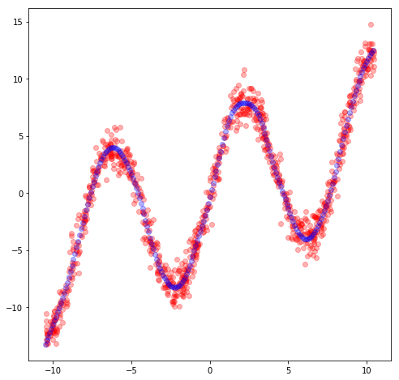
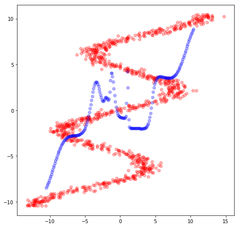
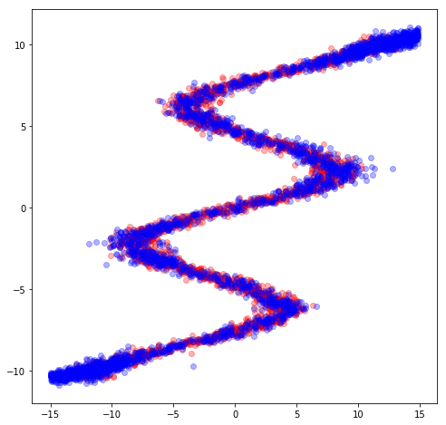

# mdn_keras
mdn implement in keras

混合密度网络(Mixture Density Networks)的简单实验，参考http://blog.otoro.net/2015/11/24/mixture-density-networks-wit
其中，mdn-tf为链接中的tf实现，对版本问题做了些修改跑通

mdn-keras为参照上述代码用keras实现，注意其中MDN的隐藏层部分，用原文的24效果较差，如果有懂得求教我啊。。。

